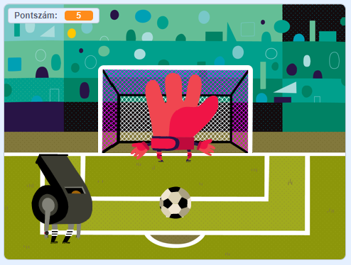

# Scratch-projekt
Ebben a Scratch projetkben egy büntetőrúgás szimulációs játékot alkottam meg. 
A játék menete: A labdát a kurzor pozicionálásával és a "space" gomb lenyomásával tudod elrugni. A kapus véletlenszerűen balra, jobbra vagy középre vetődik. 
Jó játékot kívánok.   

